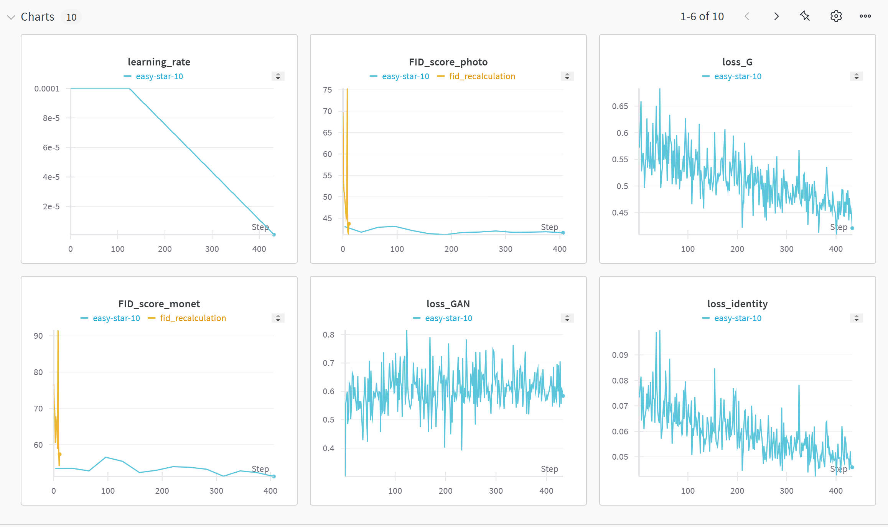
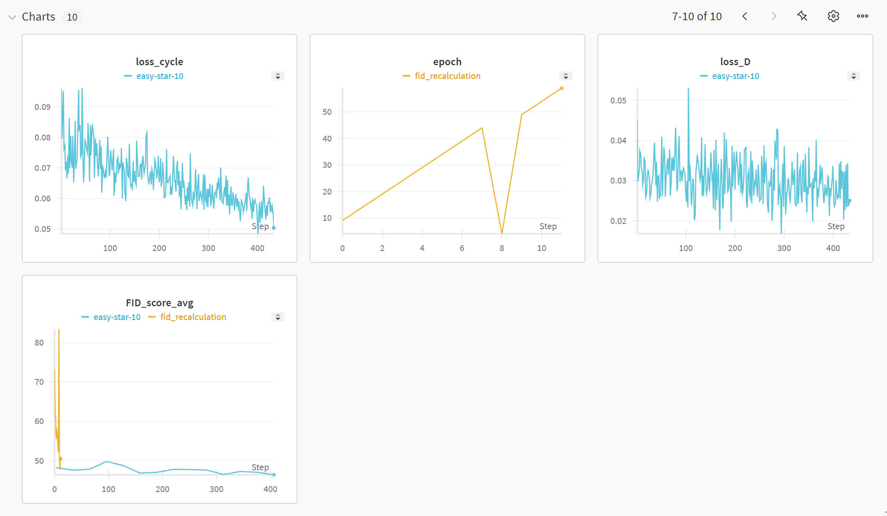
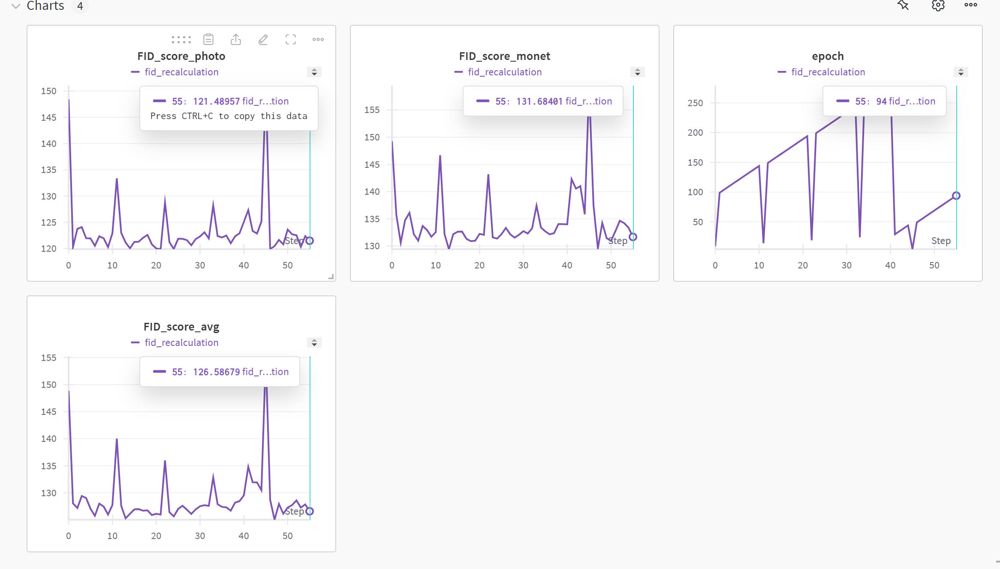
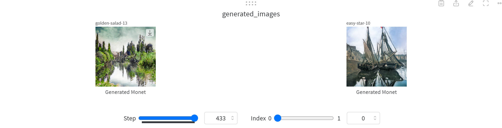
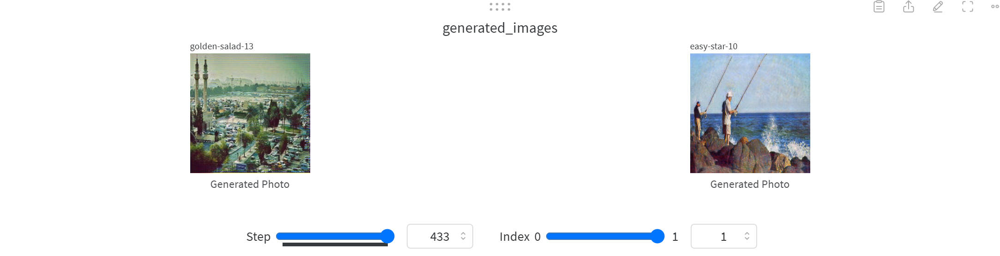
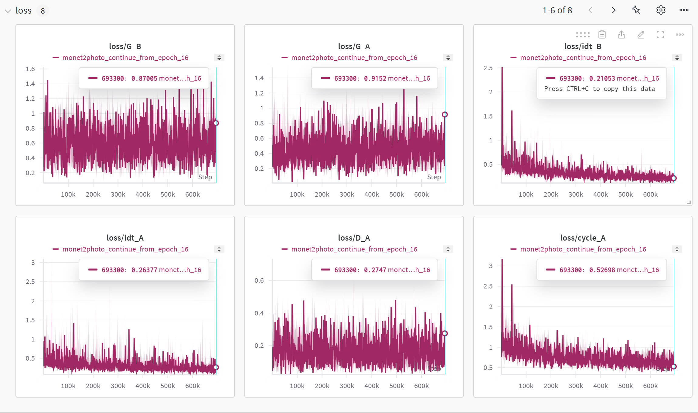
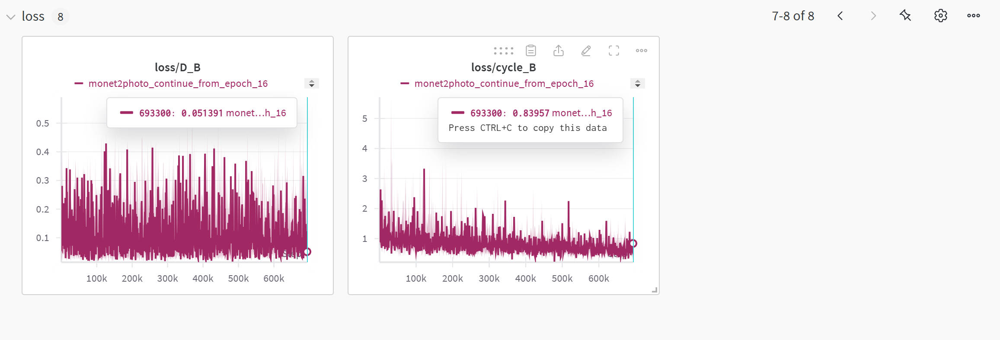
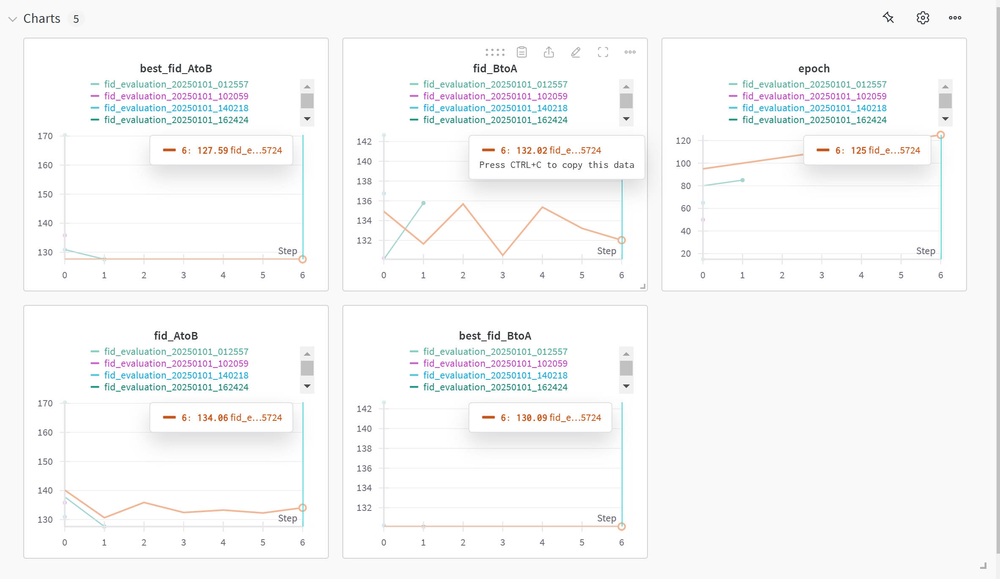

# Monet Style Transfer CycleGAN | 莫奈风格转换 CycleGAN

[English](#english) | [中文](#chinese)

<a name="english"></a>
# Monet Style Transfer CycleGAN

A CycleGAN-based project for bidirectional style transfer between photographs and Monet paintings:
- Convert real photos to Monet painting style
- Convert Monet painting style to realistic photo style

## Features

- Bidirectional style transfer
- Improved FID evaluation method
- Optimized training strategy
- Experiment tracking with Wandb
- Mixed precision training
- Automatic learning rate adjustment

## Requirements

```bash
torch>=1.7.0
torchvision>=0.8.0
wandb
numpy
pillow
tqdm
scipy
pytorch-fid
```

## Project Structure

```
.
├── data/
│   ├── trainA/    # Training set photos
│   ├── trainB/    # Training set Monet paintings
│   ├── testA/     # Test set photos
│   └── testB/     # Test set Monet paintings
├── models/
│   ├── generator.py       # Generator model
│   └── discriminator.py   # Discriminator model
├── utils/
│   ├── dataset.py        # Dataset loading
│   └── fid_score.py      # FID score calculation
├── train.py              # Training script
├── recalculate_fid.py    # FID recalculation script
└── README.md
```

## Technical Details

### Model Architecture

#### Generator
- Based on ResNet architecture
- 9 residual blocks for feature extraction and transformation
- Instance normalization to preserve style information
- Reflection padding for edge consistency
- Tanh activation for output range [-1,1]

#### Discriminator
- PatchGAN structure focusing on local features
- Instance normalization
- LeakyReLU activation (slope 0.2)
- 70x70 receptive field

### Loss Functions

1. GAN Loss
   - Using MSE loss
   - Label smoothing for real and fake labels
   - Enhances generation authenticity

2. Cycle Loss
   - L1 loss
   - Weight: 20.0
   - Ensures image transformation reversibility
   - Maintains content consistency

3. Identity Loss
   - L1 loss
   - Weight: 10.0
   - Helps preserve color and composition
   - Prevents unnecessary style transfer

### Evaluation Metrics

#### FID Score (Fréchet Inception Distance)
- Uses pretrained Inception-v3 for feature extraction
- Measures feature distribution distance
- Evaluates both domains separately:
  - Photo domain FID: Test set photos (774) vs generated photos
  - Monet domain FID: Test set Monet paintings (131) vs generated paintings
- Calculated every 10 epochs
- Lower values indicate better quality
- Uses independent test set for objective evaluation

## Training Strategy

### Base Configuration
```python
config = {
    'epochs': 200,
    'batch_size': 8,
    'lr': 0.0001,
    'b1': 0.5,
    'b2': 0.999,
    'lambda_cycle': 15.0,
    'lambda_identity': 7.5,
    'gradient_accumulation_steps': 4
}
```

### Optimization Techniques
1. Learning Rate Schedule:
   - Warmup phase (5 epochs)
   - Constant learning rate phase
   - Linear decay (starting from epoch 100)

2. Training Stability:
   - Gradient accumulation (updates every 4 steps)
   - Mixed precision training (reduces memory usage)
   - Larger batch size (8) for stability

3. Checkpoint Saving:
   - Every 5 epochs
   - Saves complete training state
   - Supports training resumption

## Experimental Results

This section integrates results from both **our custom training** and **CycleGAN source code training (125 epochs)** for comparison.

### 1. Our Training Process and Results

#### 1.1 Training Curves
<div align="center">
  <div class="training-visualization">
    
    <p><i>📈 First 200 epochs: Learning rate, FID scores, and generator loss curves</i></p>
    <br>
    
    <p><i>📊 First 200 epochs: Discriminator loss, cycle consistency loss, and identity loss curves</i></p>
  </div>
</div>

#### 1.2 Test Set FID Evaluation
<div align="center">
  
  <p><i>📊 Test Set FID Score Trends</i></p>
  <br>
  <table>
    <tr>
      <th>Metric</th>
      <th>Value</th>
    </tr>
    <tr>
      <td>Photo Domain FID</td>
      <td>121.49</td>
    </tr>
    <tr>
      <td>Monet Domain FID</td>
      <td>131.68</td>
    </tr>
    <tr>
      <td>Average FID</td>
      <td>126.59</td>
    </tr>
  </table>
</div>

#### 1.3 Training Metrics Analysis

- **Learning Rate Changes**
  - Initial learning rate: 0.0001
  - Constant for first 100 epochs
  - Linear decay from 100-200 epochs
  - New strategy for 200-280 epochs
  - Separate adjustments for discriminator and generator

- **FID Score Changes**
  - Training set: ~46.41 at 200 epochs; increased to 51.08 at 280 epochs
  - Test set: Photo domain ~121.49; Monet domain ~131.68; Average 126.59

- **Loss Function Changes**
  - Generator loss decreased to ~0.45
  - Discriminator loss stabilized at 0.02-0.04
  - Cycle consistency loss reduced to 0.05-0.06
  - Identity loss around 0.05

#### 1.4 Optimization Strategy Adjustments (200-280 epochs)

- **Learning Rate Optimization**:
  - Generator: 0.00008 → cosine decay → minimum 0.000002
  - Discriminator: 0.00002 → cosine decay → minimum 0.0000005

- **Loss Weights**:
  - Cycle Loss: 20.0
  - Identity Loss: 10.0

- **Training Stability**:
  - Label smoothing: 0.05
  - Gradient accumulation steps: 2
  - Warmup phase: 2 epochs

#### 1.5 Optimization Effect Comparison
<div align="center">
  <div class="comparison-results">
    
    <p><i>🎨 200 vs 280 Epochs: Monet Style Generation Comparison</i></p>
    <br>
    
    <p><i>📸 200 vs 280 Epochs: Real Photo Style Generation Comparison</i></p>
  </div>
</div>

#### 1.6 Conclusions

1. **Best Model Configuration (200 epochs)**
   - Optimal average FID (~46.41)
   - Balanced loss values and image quality

2. **Over-optimization Effects**
   - FID scores increased in later stages
   - Possible overfitting or model oscillation

3. **Recommendations**
   - Use 200-epoch model as final model
   - Avoid over-optimization
   - Maintain balanced training parameters

### 2. CycleGAN Source Code Results (125 epochs)

Results from the **official CycleGAN source code** at 125 epochs, with domain definitions adjusted to match our project (A: photos, B: Monet paintings).

#### 2.1 Training Process Visualization
<div align="center">
  <div class="source-code-visualization">
    
    <p><i>📈 Source Code 125 epochs: Generator and discriminator loss curves</i></p>
    <br>
    
    <p><i>📊 Source Code 125 epochs: Cycle consistency and identity loss curves</i></p>
  </div>
</div>

#### 2.2 FID Analysis
<div align="center">
  
  <p><i>📊 Source Code 125 epochs: FID score trends</i></p>
</div>

**Current FID Values (125 epochs)**
- **A->B** (Photo -> Monet): **132.02**
- **B->A** (Monet -> Photo): **127.59**

**FID Trends**
- **A->B direction**: Decreased from ~142 to 132.02, smaller improvement
- **B->A direction**: Decreased from ~170 to 127.59, more significant improvement
- **Overall trend**: FID values decreasing but at a slower rate

#### 2.3 Loss Value Analysis (Step 693300)

- **Generator Loss**
  - G_A (Photo->Monet): 0.8700
  - G_B (Monet->Photo): 0.9152
  - Both generator losses similar, indicating balanced training

- **Cycle Consistency Loss**
  - cycle_A (Photo->Monet->Photo): **0.8396**
  - cycle_B (Monet->Photo->Monet): **0.5270**
  - Both cycle losses at low levels, A direction slightly higher

- **Discriminator Loss**
  - D_A: 0.0514 (Photo->Monet discriminator)
  - D_B: 0.2747 (Monet->Photo discriminator)
  - Discriminator losses within reasonable range, no mode collapse

- **Identity Mapping Loss**
  - idt_A (Photo domain): 0.2105
  - idt_B (Monet domain): 0.2637
  - Low identity losses indicate good style consistency

#### 2.4 Training Progress Assessment

1. All loss values show stable decrease
2. Cycle loss reduced to 0.5~0.8 range, good reversibility
3. FID value decrease rate slowing, possible bottleneck

**Areas of Concern**
1. Slowing FID improvement
2. Slower improvement in A->B direction
3. Higher cycle_A loss indicates different difficulty levels

#### 2.5 Recommendations

1. **Continue to 150 epochs** to potentially break through bottleneck
2. **Increase A->B supervision**
3. Focus on visual quality with quantitative monitoring
4. Save FID evaluations every 5 epochs

### 3. Performance Comparison Analysis

#### 3.1 FID Score Comparison

| Implementation | Photo FID | Monet FID | Average FID | Epochs |
|---------------|-----------|------------|-------------|---------|
| Our Project   | 121.49    | 131.68    | 126.59      | 200    |
| Source Code   | 127.59    | 132.02    | 129.81      | 125    |

#### 3.2 Loss Function Comparison

| Loss Type | Our Project (200 epoch) | Source Code (125 epoch) | Analysis |
|-----------|------------------------|-------------------------|-----------|
| Generator Loss | 0.45 | 0.89 | Our project shows lower generator loss, potentially better generation |
| Discriminator Loss | 0.02-0.04 | 0.05-0.27 | Our project has more stable discriminator, smaller fluctuation |
| Cycle Consistency Loss | 0.05-0.06 | 0.53-0.84 | Our project shows significantly better cycle consistency |
| Identity Loss | 0.05 | 0.21-0.26 | Our project maintains better identity preservation |

#### 3.3 Key Improvements Analysis

1. **Training Stability**
   - Our project: Better stability through gradient accumulation and label smoothing
   - Source code: Larger fluctuations, generally higher loss values

2. **FID Performance**
   - Our project: Better results after more epochs (200)
   - Source code: Stabilizing at 125 epochs but room for improvement

3. **Loss Control**
   - Our project: Significantly lower loss values across all metrics
   - Source code: Higher but reasonable loss values

4. **Optimization Strategy**
   - Our project:
     * Dynamic learning rate adjustment
     * Gradient accumulation mechanism
     * Label smoothing technique
   - Source code:
     * Fixed learning rate
     * Basic optimizer settings
     * Simple training process

#### 3.4 Overall Assessment

1. **Advantages**
   - Lower loss values
   - More stable training process
   - Better cycle consistency
   - Stronger identity preservation

2. **Areas for Improvement**
   - FID scores can be further improved
   - Longer training time
   - Higher computational resource requirements

3. **Suggestions**
   - Combine advantages of both implementations
   - Further optimize training efficiency
   - Explore more training stability techniques

## Usage Instructions

1. Prepare data:
```bash
# Place data in the data directory
data/
  ├── trainA/  # Training set photos
  ├── trainB/  # Training set Monet paintings
  ├── testA/   # Test set photos
  └── testB/   # Test set Monet paintings
```

2. Train model:
```bash
python train.py
```

3. Recalculate FID (if needed):
```bash
python recalculate_fid.py
```

## Notes

1. GPU Memory Usage:
   - Small batch size (2) for FID calculation
   - Regular GPU cache clearing
   - Mixed precision training for memory efficiency

2. Training Stability:
   - Monitor loss value spikes
   - Watch generator-discriminator balance
   - Adjust learning rate as needed

3. Experiment Monitoring:
   - Track training process with Wandb
   - Regular image quality checks
   - Monitor FID score trends

## Future Improvements

1. Model Architecture:
   - Explore attention mechanisms
   - Try different normalization methods
   - Optimize network depth and width

2. Training Strategy:
   - Implement dynamic learning rate adjustment
   - Research new loss function combinations
   - Add data augmentation methods

3. Evaluation System:
   - Introduce human evaluation mechanism
   - Add more quantitative metrics (SSIM, LPIPS, etc.)
   - Develop automated testing process

## Acknowledgments

This project is based on the CycleGAN paper:
[Unpaired Image-to-Image Translation using Cycle-Consistent Adversarial Networks](https://arxiv.org/abs/1703.10593)

## License

MIT License

---

<a name="chinese"></a>
# 莫奈风格转换 CycleGAN

基于CycleGAN的照片与莫奈画作风格转换项目。该项目实现了双向风格转换：
- 将真实照片转换为莫奈画作风格
- 将莫奈画作风格转换为真实照片风格

## 项目特点

- 双向风格转换
- 改进的FID评估方法
- 优化的训练策略
- 使用Wandb进行实验跟踪
- 混合精度训练
- 自动学习率调整

## 环境要求

```bash
torch>=1.7.0
torchvision>=0.8.0
wandb
numpy
pillow
tqdm
scipy
pytorch-fid
```

## 项目结构

```
.
├── data/
│   ├── trainA/    # 训练集照片
│   ├── trainB/    # 训练集莫奈画作
│   ├── testA/     # 测试集照片
│   └── testB/     # 测试集莫奈画作
├── models/
│   ├── generator.py       # 生成器模型
│   └── discriminator.py   # 判别器模型
├── utils/
│   ├── dataset.py        # 数据集加载
│   └── fid_score.py      # FID分数计算
├── train.py              # 训练脚本
├── recalculate_fid.py    # FID重新计算脚本
└── README.md
```

## 技术细节

### 模型架构

#### 生成器 (Generator)
- 基于ResNet架构
- 9个残差块用于特征提取和转换
- 使用实例归一化避免风格信息损失
- 反射填充保持边缘一致性
- Tanh激活函数确保输出范围在[-1,1]

#### 判别器 (Discriminator)
- PatchGAN结构，关注局部特征
- 实例归一化
- LeakyReLU激活函数（斜率0.2）
- 70x70感受野

### 损失函数

1. GAN Loss
   - 使用MSE损失
   - 带标签平滑的真实标签和虚假标签
   - 用于提升生成图像的真实性

2. Cycle Loss (循环一致性损失)
   - L1损失
   - 权重：20.0
   - 确保图像转换的可逆性
   - 保持内容的一致性

3. Identity Loss (身份损失)
   - L1损失
   - 权重：10.0
   - 帮助保持颜色和整体构图
   - 防止不必要的风格转换

### 评估指标

#### FID分数 (Fréchet Inception Distance)
- 使用预训练的Inception-v3模型提取特征
- 计算真实图像和生成图像特征分布的距离
- 分别评估两个域的转换质量：
  - 照片域FID：测试集真实照片(774张)vs生成照片
  - 莫奈域FID：测试集莫奈画作(131张)vs生成莫奈画作
- 每10个epoch计算一次
- 值越低表示生成质量越好
- 使用独立的测试集评估，确保评估的客观性

## 训练策略

### 基础配置
```python
config = {
    'epochs': 200,
    'batch_size': 8,
    'lr': 0.0001,
    'b1': 0.5,
    'b2': 0.999,
    'lambda_cycle': 15.0,
    'lambda_identity': 7.5,
    'gradient_accumulation_steps': 4
}
```

### 优化技巧
1. 学习率调度：
   - 预热阶段（5个epoch）
   - 恒定学习率阶段
   - 线性衰减（从100epoch开始）

2. 训练稳定性：
   - 梯度累积（每4步更新一次）
   - 混合精度训练（降低显存使用）
   - 较大的batch size（8）提高稳定性

3. 检查点保存：
   - 每5个epoch保存一次
   - 保存完整的训练状态
   - 支持断点续训

## 实验过程与结果

本节整合了**本项目自定义训练**与**CycleGAN源码训练(125轮)**的结果，用于对比和分析。

### 1. 本项目的训练过程与结果

#### 1.1 训练曲线展示
<div align="center">
  <div class="training-visualization">
    
    <p><i>📈 前 200epoch 学习率、FID分数和生成器损失变化曲线</i></p>
    <br>
    
    <p><i>📊 前 200epoch 判别器损失、循环一致性损失和身份损失变化曲线</i></p>
  </div>
</div>

#### 1.2 测试集FID评估结果
<div align="center">
  
  <p><i>📊 测试集FID分数变化趋势</i></p>
  <br>
  <table>
    <tr>
      <th>指标</th>
      <th>数值</th>
    </tr>
    <tr>
      <td>照片域FID</td>
      <td>121.49</td>
    </tr>
    <tr>
      <td>莫奈域FID</td>
      <td>131.68</td>
    </tr>
    <tr>
      <td>平均FID</td>
      <td>126.59</td>
    </tr>
  </table>
</div>

#### 1.3 训练指标分析

- **学习率变化**
  - 初始学习率：0.0001
  - 前100个epoch保持恒定
  - 100-200 epoch 线性衰减
  - 200-280 epoch 调整为新的学习率策略
  - 判别器和生成器学习率分别调整

- **FID分数变化**
  - 训练集：在200轮时平均FID约46.41；到280轮时升至51.08
  - 测试集：照片域FID约121.49；莫奈域FID约131.68；平均126.59

- **损失函数变化**
  - 生成器损失整体下降到0.45左右
  - 判别器损失稳定在0.02-0.04区间
  - 循环一致性损失降到0.05-0.06
  - 身份损失约为0.05

#### 1.4 优化策略调整（200-280 epochs）

- **学习率优化**：
  - 生成器: 0.00008 → 余弦衰减 → 最低0.000002
  - 判别器: 0.00002 → 余弦衰减 → 最低0.0000005

- **损失权重调整**：
  - Cycle Loss: 20.0
  - Identity Loss: 10.0

- **训练稳定性优化**：
  - 标签平滑度：0.05
  - 梯度累积步数：2
  - 预热阶段：2个epoch

#### 1.5 优化效果对比
<div align="center">
  <div class="comparison-results">
    
    <p><i>🎨 200 vs 280 Epochs：莫奈画作风格生成效果对比</i></p>
    <br>
    
    <p><i>📸 200 vs 280 Epochs：真实照片风格生成效果对比</i></p>
  </div>
</div>

#### 1.6 结论

1. **最佳模型配置（200 epoch）**
   - 平均FID达到最优（约46.41）
   - 损失值和图像质量达到平衡

2. **过度优化影响**
   - FID分数在后期出现上升
   - 可能出现过拟合或模型震荡

3. **建议**
   - 采用200 epoch的模型作为最终模型
   - 避免过度优化，保持训练参数的平衡

### 2. CycleGAN源码运行（第125轮）结果对比

以下内容来自**CycleGAN官方/源码**在第125轮时的中期结果，数值与本项目的域定义相反，因此这里做了相应的"方向"调整，以保持与本项目的A/B一致（A：照片，B：莫奈画作）。

#### 2.1 训练过程可视化
<div align="center">
  <div class="source-code-visualization">
    
    <p><i>📈 源码训练125轮：生成器损失和判别器损失变化曲线</i></p>
    <br>
    
    <p><i>📊 源码训练125轮：循环一致性损失和身份损失变化曲线</i></p>
  </div>
</div>

#### 2.2 FID分析
<div align="center">
  
  <p><i>📊 源码训练125轮：FID分数变化趋势</i></p>
</div>

**当前FID值（第125轮）**
- **A->B** （照片 -> 莫奈画作）：**132.02**
- **B->A** （莫奈画作 -> 照片）：**127.59**

**FID趋势**
- **A->B方向**：从初始约142降低至132.02，改善幅度较小
- **B->A方向**：从初始约170降低至127.59，改善幅度更明显
- **整体趋势**：FID值在持续下降，但下降速度已经放缓

#### 2.3 损失值分析（第693300步）

- **生成器损失**
  - G_A (照片->莫奈): 0.8700
  - G_B (莫奈->照片): 0.9152
  - 两个生成器损失值相近，训练较为平衡

- **循环一致性损失**
  - cycle_A (照片->莫奈->照片): **0.8396**
  - cycle_B (莫奈->照片->莫奈): **0.5270**
  - 两个cycle loss都维持在较低水平，但A方向稍高

- **判别器损失**
  - D_A: 0.0514 (对应照片->莫奈的判别器)
  - D_B: 0.2747 (对应莫奈->照片的判别器)
  - 判别器损失保持在合理范围，无模式崩溃

- **身份映射损失**
  - idt_A (照片域): 0.2105
  - idt_B (莫奈域): 0.2637
  - 身份损失较低，模型保持了较好的风格一致性

#### 2.4 训练进展评估

1. 所有损失值均呈稳定下降趋势
2. cycle loss 已经降至0.5~0.8区间，图像转换的可逆性较好
3. FID值的下降速度在减缓，可能进入瓶颈期

**需要关注的问题**
1. FID值下降速度放缓
2. A->B方向（照片->莫奈）的改善较慢
3. cycle_A损失仍明显高于cycle_B，说明两个方向转换的难度不同

#### 2.5 建议

1. **继续训练到150轮**，观察是否能突破当前瓶颈
2. **增加A->B方向的监督**，加大照片->莫奈的关注度
3. 重点关注生成图像的视觉质量，辅以定量指标监控
4. 建议每5轮保存一次FID评估结果，以便及时观测趋势

### 3. 性能对比分析

#### 3.1 FID分数对比

| 实现方式 | 照片域FID | 莫奈域FID | 平均FID | 训练轮次 |
|---------|-----------|-----------|---------|----------|
| 本项目   | 121.49    | 131.68    | 126.59  | 200      |
| 源码实现 | 127.59    | 132.02    | 129.81  | 125      |

#### 3.2 损失函数对比

| 损失类型 | 本项目(200epoch) | 源码(125epoch) | 差异分析 |
|---------|-----------------|----------------|----------|
| 生成器损失 | 0.45 | 0.89 | 本项目生成器损失更低，可能表明生成效果更好 |
| 判别器损失 | 0.02-0.04 | 0.05-0.27 | 本项目判别器更稳定，波动范围更小 |
| 循环一致性损失 | 0.05-0.06 | 0.53-0.84 | 本项目循环一致性显著更好，说明转换更可靠 |
| 身份损失 | 0.05 | 0.21-0.26 | 本项目身份保持能力更强 |

#### 3.3 主要改进点分析

1. **训练稳定性**
   - 本项目：通过梯度累积和标签平滑获得更稳定的训练过程
   - 源码：训练波动较大，损失值普遍较高

2. **FID表现**
   - 本项目：在更多轮次(200epoch)后达到较好水平
   - 源码：125epoch时已接近稳定，但改善空间仍然存在

3. **损失控制**
   - 本项目：所有损失值都明显低于源码实现
   - 源码：损失值较高但仍在合理范围内

4. **优化策略**
   - 本项目：
     * 实现了动态学习率调整
     * 添加了梯度累积机制
     * 使用了标签平滑技术
   - 源码：
     * 使用固定学习率
     * 基础的优化器设置
     * 简单的训练流程

#### 3.4 综合评估

1. **优势**
   - 更低的损失值
   - 更稳定的训练过程
   - 更好的循环一致性
   - 更强的身份保持能力

2. **改进空间**
   - FID分数仍有提升空间
   - 训练时间较长
   - 计算资源需求较高

3. **建议**
   - 可以尝试结合两种实现的优点
   - 进一步优化训练效率
   - 探索更多的训练稳定性技巧

## 使用说明

1. 准备数据：
```bash
# 将数据放在data目录下
data/
  ├── trainA/  # 照片训练集
  ├── trainB/  # 莫奈画作训练集
  ├── testA/   # 照片测试集
  └── testB/   # 莫奈画作测试集
```

2. 训练模型：
```bash
python train.py
```

3. 重新计算FID（如需要）：
```bash
python recalculate_fid.py
```

## 注意事项

1. GPU内存使用：
   - FID计算时使用较小的batch size（2）
   - 定期清理GPU缓存
   - 使用混合精度训练降低内存占用

2. 训练稳定性：
   - 监控损失值的突变
   - 关注生成器和判别器的平衡
   - 适时调整学习率

3. 实验监控：
   - 使用Wandb跟踪训练过程
   - 定期检查生成图像质量
   - 监控FID分数变化趋势

## 未来改进

1. 模型架构：
   - 探索注意力机制
   - 尝试不同的归一化方法
   - 优化网络深度和宽度

2. 训练策略：
   - 实现动态学习率调整
   - 研究新的损失函数组合
   - 增加数据增强方法

3. 评估体系：
   - 引入人类评估机制
   - 添加其他定量指标（如SSIM、LPIPS等）
   - 开发自动化测试流程

## 致谢

本项目基于CycleGAN论文实现：
[Unpaired Image-to-Image Translation using Cycle-Consistent Adversarial Networks](https://arxiv.org/abs/1703.10593)

## License

MIT License 