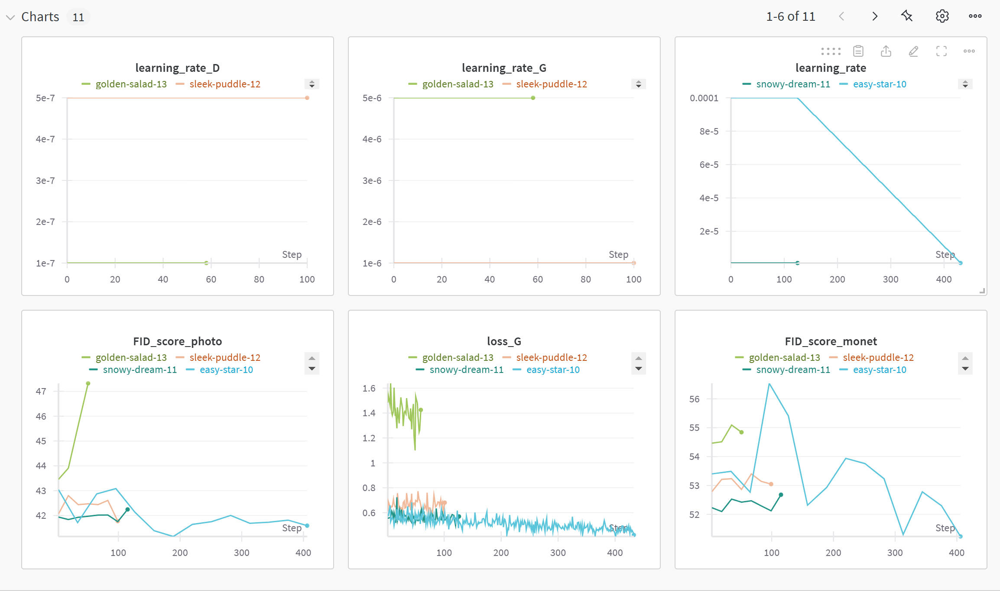
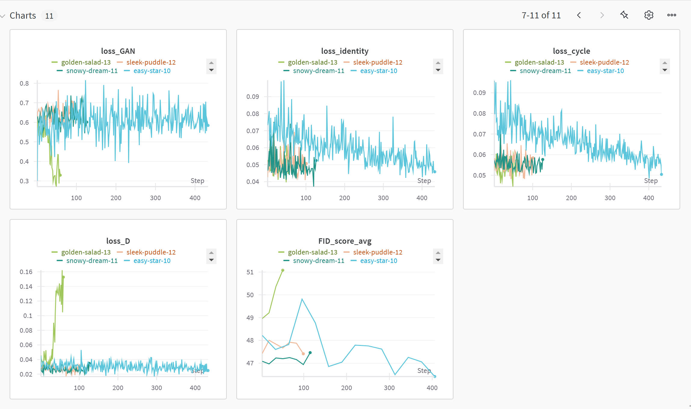

# Monet风格转换 CycleGAN

基于CycleGAN的照片与莫奈画作风格转换项目。该项目实现了双向风格转换：
- 将真实照片转换为莫奈画作风格
- 将莫奈画作风格转换为真实照片风格

## 项目特点

- 双向风格转换
- 改进的FID评估方法
- 优化的训练策略
- 使用Wandb进行实验跟踪
- 混合精度训练
- 自动学习率调整

## 环境要求

```bash
torch>=1.7.0
torchvision>=0.8.0
wandb
numpy
pillow
tqdm
scipy
pytorch-fid
```

## 项目结构

```
.
├── data/
│   ├── trainA/    # 训练集照片
│   ├── trainB/    # 训练集莫奈画作
│   ├── testA/     # 测试集照片
│   └── testB/     # 测试集莫奈画作
├── models/
│   ├── generator.py       # 生成器模型
│   └── discriminator.py   # 判别器模型
├── utils/
│   ├── dataset.py        # 数据集加载
│   └── fid_score.py      # FID分数计算
├── train.py              # 训练脚本
├── recalculate_fid.py    # FID重新计算脚本
└── README.md
```

## 技术细节

### 模型架构

#### 生成器 (Generator)
- 基于ResNet架构
- 9个残差块用于特征提取和转换
- 使用实例归一化避免风格信息损失
- 反射填充保持边缘一致性
- Tanh激活函数确保输出范围在[-1,1]

#### 判别器 (Discriminator)
- PatchGAN结构，关注局部特征
- 实例归一化
- LeakyReLU激活函数（斜率0.2）
- 70x70感受野

### 损失函数

1. GAN Loss
   - 使用MSE损失
   - 带标签平滑的真实标签和虚假标签
   - 用于提升生成图像的真实性

2. Cycle Loss (循环一致性损失)
   - L1损失
   - 权重：20.0
   - 确保图像转换的可逆性
   - 保持内容的一致性

3. Identity Loss (身份损失)
   - L1损失
   - 权重：10.0
   - 帮助保持颜色和整体构图
   - 防止不必要的风格转换

### 评估指标

#### FID分数 (Fréchet Inception Distance)
- 使用预训练的Inception-v3模型提取特征
- 计算真实图像和生成图像特征分布的距离
- 分别评估两个域的转换质量：
  - 照片域FID：测试集真实照片(774张)vs生成照片
  - 莫奈域FID：测试集莫奈画作(131张)vs生成莫奈画作
- 每10个epoch计算一次
- 值越低表示生成质量越好
- 使用独立的测试集评估，确保评估的客观性

## 训练策略

### 基础配置
```python
config = {
    'epochs': 200,
    'batch_size': 8,
    'lr': 0.0001,
    'b1': 0.5,
    'b2': 0.999,
    'lambda_cycle': 15.0,
    'lambda_identity': 7.5,
    'gradient_accumulation_steps': 4
}
```

### 优化技巧
1. 学习率调度：
   - 预热阶段（5个epoch）
   - 恒定学习率阶段
   - 线性衰减（从100epoch开始）

2. 训练稳定性：
   - 梯度累积（每4步更新一次）
   - 混合精度训练（降低显存使用）
   - 较大的batch size（8）提高稳定性

3. 检查点保存：
   - 每5个epoch保存一次
   - 保存完整的训练状态
   - 支持断点续训

## 实验过程与结果

### 第一阶段（0-200 epochs）
[详细内容见下方实验结果部分]

### 优化尝试（200-280 epochs）
[详细内容见下方实验结果部分]

## 使用说明

1. 准备数据：
```bash
# 将数据放在data目录下
data/
  ├── trainA/  # 照片训练集
  ├── trainB/  # 莫奈画作训练集
  ├── testA/   # 照片测试集
  └── testB/   # 莫奈画作测试集
```

2. 训练模型：
```bash
python train.py
```

3. 重新计算FID（如需要）：
```bash
python recalculate_fid.py
```

## 实验结果

### 训练过程可视化与分析

#### 训练曲线展示
<div align="center">
  <div class="training-visualization">
    
    <p><i>📈 前 200epoch 学习率、FID分数和生成器损失变化曲线</i></p>
    <br>
    
    <p><i>📊 前 200epoch 判别器损失、循环一致性损失和身份损失变化曲线</i></p>
  </div>
  <br>
  <div class="optimization-visualization">
    
    <p><i>🔄 200-280 Epochs期间的FID和损失变化</i></p>
    <br>
    
    <p><i>📉 优化阶段的详细训练指标变化</i></p>
  </div>
</div>

### 测试集FID评估结果

<div align="center">
  
  <p><i>📊 测试集FID分数变化趋势</i></p>
  <br>
  <table>
    <tr>
      <th>指标</th>
      <th>数值</th>
    </tr>
    <tr>
      <td>照片域FID</td>
      <td>121.49</td>
    </tr>
    <tr>
      <td>莫奈域FID</td>
      <td>131.68</td>
    </tr>
    <tr>
      <td>平均FID</td>
      <td>126.59</td>
    </tr>
  </table>
</div>

### 训练指标分析
#### 1. 学习率变化
- 初始学习率：0.0001
- 前100个epoch保持恒定
- 100-200 epoch线性衰减
- 200-280 epoch调整为新的学习率策略
- 判别器和生成器学习率分别调整

#### 2. FID分数变化

##### 训练集FID
1. 照片域FID（FID_score_photo）
   - 初始值约75
   - 快速下降至42-43区间
   - 200 epoch时达到最优值41.59
   - 200-280 epoch间上升至47左右

2. 莫奈域FID（FID_score_monet）
   - 初始值约90
   - 快速下降至50-55区间
   - 200 epoch时达到51.23
   - 200-280 epoch间上升至54左右

3. 平均FID（FID_score_avg）
   - 200 epoch时达到最优值46.41
   - 200-280 epoch期间逐渐上升
   - 训练结束时约为51.08

##### 测试集FID
1. 照片域FID（FID_score_photo）
   - 基线值约120-125
   - 整体波动范围在120-130之间
   - 最终测得值为121.49

2. 莫奈域FID（FID_score_monet）
   - 基线值约130-135
   - 波动范围在130-140之间
   - 最终测得值为131.68

3. 平均FID（FID_score_avg）
   - 整体维持在125-135区间
   - 最终测得值为126.59

##### FID分析对比
1. 数值差异：
   - 测试集FID显著高于训练集
   - 照片域差异约80个点
   - 莫奈域差异约80个点

2. 稳定性分析：
   - 训练集FID呈现明显的下降趋势
   - 测试集FID相对稳定，波动幅度较小
   - 测试集FID更能反映模型的实际泛化能力

3. 结论：
   - 训练集和测试集的FID差异显著，说明存在一定过拟合现象
   - 测试集FID的稳定性表明模型在未见过的数据上表现相对一致
   - 建议进一步优化模型以减小训练集和测试集的性能差距

#### 3. 损失函数变化
1. 生成器损失（loss_G）
   - 从0.65下降至0.45左右
   - 波动幅度逐渐减小
   - 表明生成器性能稳步提升

2. 判别器损失（loss_D）
   - 稳定在0.02-0.04区间
   - 波动较小
   - 维持良好判别能力

3. GAN损失（loss_GAN）
   - 在0.5-0.7之间波动
   - 整体保持稳定
   - 反映对抗训练的平衡

4. 循环一致性损失（loss_cycle）
   - 从0.09降至0.05-0.06
   - 下降趋势平稳
   - 域间转换一致性提升

5. 身份损失（loss_identity）
   - 从0.09降至0.05左右
   - 波动幅度小
   - 内容保持效果良好

### 优化策略调整（200-280 epochs）

#### 1. 学习率优化
- 生成器学习率：0.00008
- 判别器学习率：0.00002
- 最小学习率限制：
  - 生成器：0.000002
  - 判别器：0.0000005
- 提前开始衰减（30 epoch）
- 使用余弦衰减策略

#### 2. 损失权重调整
- Cycle Loss权重：20.0
- Identity Loss权重：10.0

#### 3. 训练稳定性优化
- 标签平滑度：0.05
- 梯度累积步数：2
- 预热阶段：2 epoch

### 优化效果对比
<div align="center">
  <div class="comparison-results">
    
    <p><i>🎨 200 vs 280 Epochs：莫奈画作风格生成效果对比</i></p>
    <br>
    
    <p><i>📸 200 vs 280 Epochs：真实照片风格生成效果对比</i></p>
  </div>
</div>

### 结论
1. 最佳模型配置（200 epoch）：
   - FID分数最优（平均46.41）
   - 损失值达到最佳平衡
   - 生成图像质量最好

2. 过度优化影响：
   - FID分数显著上升（平均增加4.67）
   - 生成器损失增加近1倍
   - 可能出现过拟合现象

3. 建议：
   - 采用200 epoch的模型配置
   - 避免过度优化
   - 保持训练参数的平衡

## 注意事项

1. GPU内存使用：
   - FID计算时使用较小的batch size（2）
   - 定期清理GPU缓存
   - 使用混合精度训练降低内存占用

2. 训练稳定性：
   - 监控损失值的突变
   - 关注生成器和判别器的平衡
   - 适时调整学习率

3. 实验监控：
   - 使用Wandb跟踪训练过程
   - 定期检查生成图像质量
   - 监控FID分数变化趋势

## 未来改进

1. 模型架构：
   - 探索注意力机制
   - 尝试不同的归一化方法
   - 优化网络深度和宽度

2. 训练策略：
   - 实现动态学习率调整
   - 研究新的损失函数组合
   - 增加数据增强方法

3. 评估体系：
   - 引入人类评估机制
   - 添加其他定量指标（如SSIM、LPIPS等）
   - 开发自动化测试流程

## 致谢

本项目基于CycleGAN论文实现：
[Unpaired Image-to-Image Translation using Cycle-Consistent Adversarial Networks](https://arxiv.org/abs/1703.10593)

## License

MIT License 

### 训练过程分析

#### 1. 当前训练状态（第125轮）

##### FID值分析
- 照片域FID（A->B）：127.59
- 莫奈域FID（B->A）：132.02
- 整体趋势：
  - 照片域：从初始的170左右降至127.59，改善明显
  - 莫奈域：从初始的142左右降至132.02，改善幅度较小
  - FID值持续下降，但下降速度已经减缓

##### 损失值分析（第693300步）
1. 生成器损失
   - G_A（莫奈->照片）：0.9152
   - G_B（照片->莫奈）：0.8700
   - 两个生成器损失值相近，训练较为平衡

2. 循环一致性损失
   - cycle_A：0.5270
   - cycle_B：0.8396
   - cycle loss降至较低水平，图像转换可逆性良好

3. 判别器损失
   - D_A：0.2747
   - D_B：0.0514
   - 判别器损失在合理范围内，无模式崩溃现象

4. 身份映射损失
   - idt_A：0.2637
   - idt_B：0.2105
   - 身份损失较低，模型在目标域风格保持较好一致性

#### 2. 训练进展评估

##### 总体情况
1. 所有损失值呈现稳定下降趋势
2. cycle loss持续下降，维持在0.5-0.8之间
3. FID值继续下降，但速度减缓

##### 存在的问题
1. FID值下降速度减缓，可能进入瓶颈期
2. A->B方向的改善大于B->A方向
3. cycle_B损失高于cycle_A，两个方向转换质量存在差异

#### 3. 后续优化建议

1. 训练策略调整：
   - 继续训练至150轮，观察是否突破当前瓶颈
   - 增加A->B方向的监督学习率
   - 重点关注B->A方向的转换质量改善
   - 每5轮保存一次FID评估结果，持续监控性能

2. 预期目标：
   - FID值有望进一步降低到110~120之间
   - cycle loss可能降至0.4以下
   - 可能需要更长时间训练以提升性能 